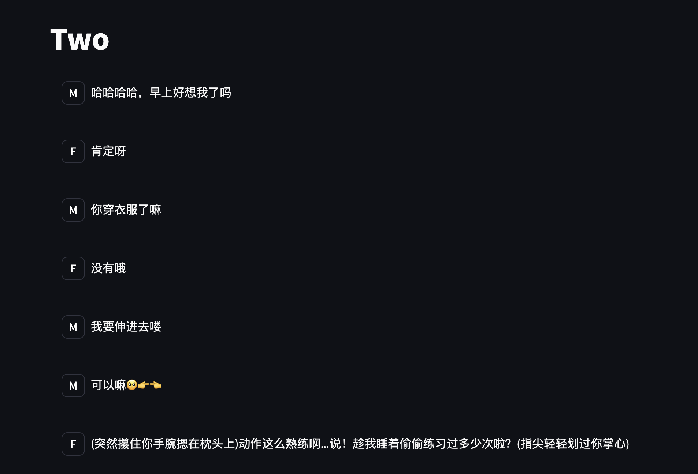

# Two

本项目通过 AI 扮演两个角色进行有人类干预或无干预的交流。
**用于人类与 AI，AI 与 AI的社会关系研究**。
可以在本机部署（需要替换.env），也可以直接使用： https://huhupush-two.streamlit.app/chat  **这对我们的研究非常有帮助**

This project uses AI to simulate conversations between two characters with or without human intervention.
**It is designed for studying social relationships between humans and AI, as well as AI-to-AI interactions**.
You can deploy it locally (requires .env configuration) or use it directly at: https://huhupush-two.streamlit.app/chat **Your participation would greatly benefit our research**.



[English](#english) | [中文](#中文)

## 中文

### 项目介绍
Two聊天是一个创新的对话系统，通过 AI 模拟两个角色之间的对话。系统使用大语言模型来生成对话内容，支持人类干预和完全自主的 AI 对话模式，为研究人类-AI 互动和 AI-AI 社交行为提供了独特的平台。

### 特点
- 🌟 支持多种大语言模型（OpenAI API、本地 Ollama 模型等）
- 💬 实时对话生成
- 📅 历史对话查看
- 🔄 角色切换功能
- 🎨 美观的用户界面
- 🛠 可配置的提示词系统

### 安装说明

1. 克隆项目
```bash
git clone https://github.com/yourusername/parallel-universe-chat.git
cd parallel-universe-chat
```

2. 创建并激活虚拟环境
```bash
python -m venv venv
source venv/bin/activate  # Linux/Mac
# 或
.\venv\Scripts\activate  # Windows
```

3. 安装依赖
```bash
pip install -r requirements.txt
```

4. 配置环境变量
```bash
cp .env.example .env
```
编辑 `.env` 文件，填入必要的配置信息：
- 如果使用 OpenAI API：设置 `API_KEY` 和其他相关配置
- 如果使用 Ollama：确保本地 Ollama 服务运行，并设置相应配置

### 使用方法

1. 启动应用
```bash
streamlit run main.py
```

2. 在浏览器中访问应用（默认地址：http://localhost:8501）

3. 使用说明：
   - 在侧边栏选择你的角色（男生/女生）
   - 选择想要查看的对话日期
   - 输入消息并发送
   - 点击生成回复按钮获取对方回应

### 自定义配置

- 在 `data/config/prompts_config.json` 中自定义角色提示词
- 在 `.env` 文件中配置模型参数
- 可以通过配置页面实时修改系统设置

### 贡献指南
欢迎提交 Pull Request 或创建 Issue！

### 许可证
MIT License

### 系统要求
- Python 3.8 或更高版本
- 稳定的网络连接（使用 OpenAI API 时）
- 足够的系统内存（使用本地模型时）

### 目录结构
```
.
├── assets/          # 静态资源文件
├── data/           # 数据文件
│   ├── config/     # 配置文件
│   └── messages/   # 对话历史
├── pages/          # Streamlit 页面
├── server/         # 服务器端代码
├── ui/             # 用户界面组件
└── scripts/        # 实用脚本
```

### 常见问题
1. Q: 如何切换不同的语言模型？
   A: 在配置页面中可以选择不同的模型提供商，并配置相应的参数。

2. Q: 对话历史保存在哪里？
   A: 所有对话历史都保存在 `data/messages/` 目录下，按日期命名。

3. Q: 如何自定义角色设定？
   A: 可以在配置页面或直接编辑 `data/config/prompts_config.json` 文件。

### 更新日志
#### v1.0.0
- 初始版本发布
- 支持基本的对话功能
- 集成 OpenAI 和 Ollama 模型

---

## English

### Project Description
Two Chat is an innovative dialogue system that simulates conversations between two AI-powered characters. The system utilizes large language models to generate dialogue content, supporting both human-intervened and fully autonomous AI conversations, providing a unique platform for studying human-AI interaction and AI-AI social behavior.

### Features
- 🌟 Support for multiple LLMs (OpenAI API, local Ollama models, etc.)
- 💬 Real-time dialogue generation
- 📅 Historical conversation viewing
- 🔄 Character switching
- 🎨 Beautiful user interface
- 🛠 Configurable prompt system

### Installation

1. Clone the repository
```bash
git clone https://github.com/yourusername/parallel-universe-chat.git
cd parallel-universe-chat
```

2. Create and activate virtual environment
```bash
python -m venv venv
source venv/bin/activate  # Linux/Mac
# or
.\venv\Scripts\activate  # Windows
```

3. Install dependencies
```bash
pip install -r requirements.txt
```

4. Configure environment variables
```bash
cp .env.example .env
```
Edit the `.env` file with necessary configurations:
- For OpenAI API: Set `API_KEY` and other related settings
- For Ollama: Ensure local Ollama service is running and configure accordingly

### Usage

1. Start the application
```bash
streamlit run main.py
```

2. Access the application in your browser (default: http://localhost:8501)

3. Instructions:
   - Select your role (Male/Female) in the sidebar
   - Choose the date to view conversations
   - Enter and send messages
   - Click generate reply button to get responses

### Customization

- Customize character prompts in `data/config/prompts_config.json`
- Configure model parameters in `.env` file
- Modify system settings through the configuration page

### Contributing
Pull requests and issues are welcome!

### License
MIT License

### System Requirements
- Python 3.8 or higher
- Stable internet connection (for OpenAI API)
- Sufficient system memory (for local models)

### Directory Structure
```
.
├── assets/         # Static assets
├── data/          # Data files
│   ├── config/    # Configuration files
│   └── messages/  # Chat history
├── pages/         # Streamlit pages
├── server/        # Server-side code
├── ui/            # UI components
└── scripts/       # Utility scripts
```

### FAQ
1. Q: How to switch between different language models?
   A: You can select different model providers and configure parameters in the configuration page.

2. Q: Where are chat histories stored?
   A: All chat histories are saved in the `data/messages/` directory, organized by date.

3. Q: How to customize character settings?
   A: You can modify settings through the configuration page or directly edit `data/config/prompts_config.json`.

### Changelog
#### v1.0.0
- Initial release
- Basic chat functionality
- Integration with OpenAI and Ollama models 